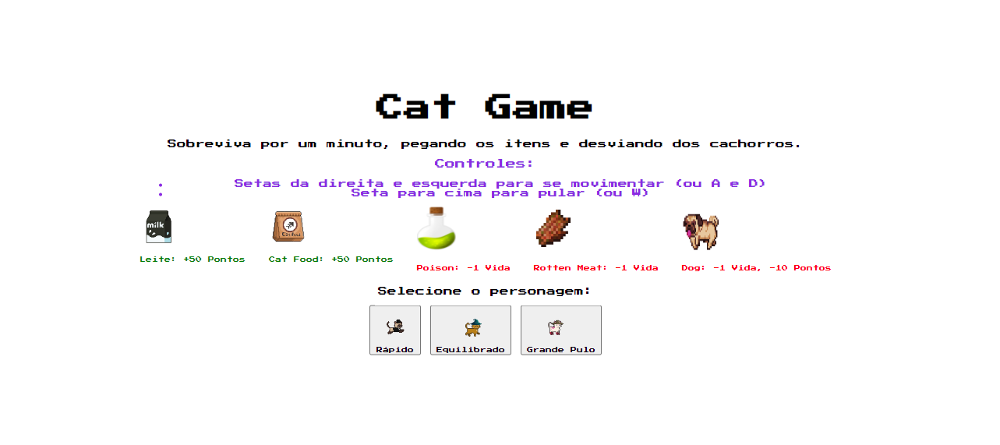
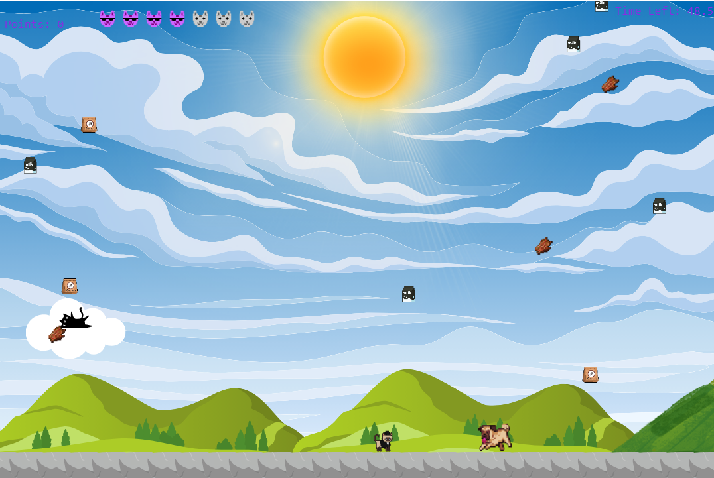
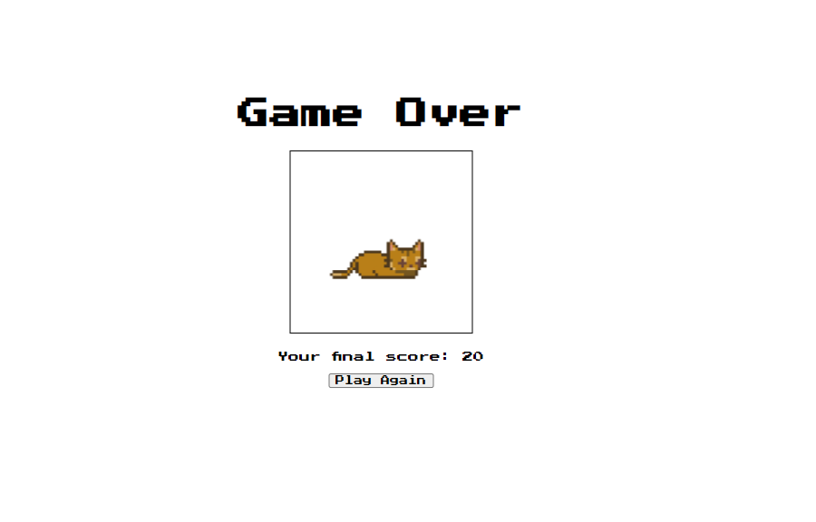

# Cat-Game 😽
 Jogo desenvolvido com JavaScript. O objetivo do jogo é avançar por diversas fases, cada uma com personagens diferentes, atingindo uma pontuação específica para progredir para a próxima fase.

## Características 😸

- Divertido 😻
- Interativo 😼
- Fluidez 🙀

### Como Jogar 😽

1. Abra o jogo.
2. Clique no gatinho.
3. Divirta-se 😺!

# Aqui está imagens do meu projeto:

